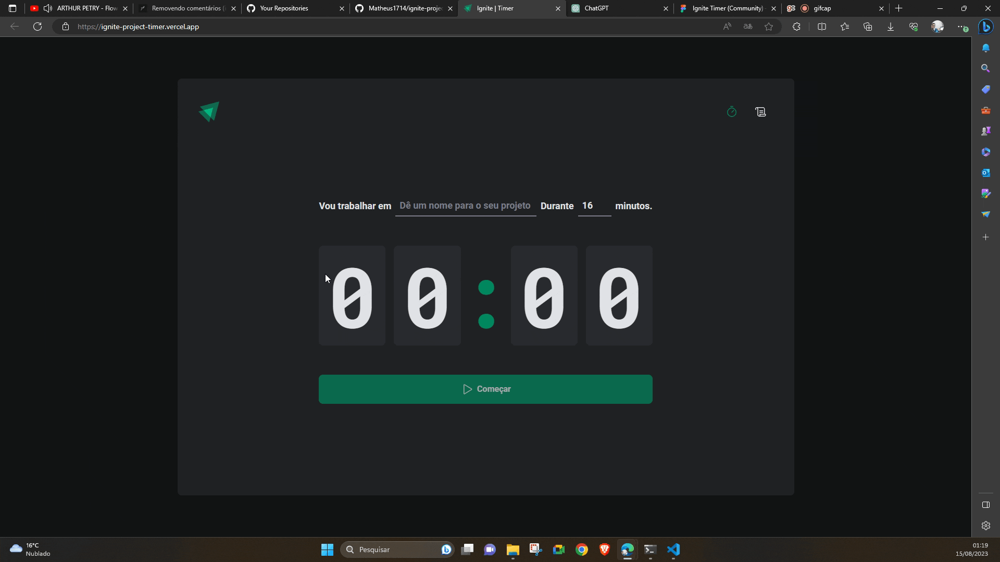

# [Ignite Timer](https://ignite-project-timer.vercel.app/) 🚀



This is a project created using the concepts learned in [Rocketseat's](https://www.rocketseat.com.br/) classes in the Ignite program for a Task Timer.

## Design

This Front-end project was developed based on the design proposed in [Figma](https://www.figma.com/file/qa2C3PGh8DxuLfklUH0bb3/Ignite-Timer-(Community)?type=design&node-id=0%3A1&mode=design&t=oEUoOMqp03iGsUHg-1).


## Technologies

This project was developed using Vite + ReactJS, Typescript.

The project dependencies were:

```json
"dependencies": {
   "@hookform/resolvers": "^3.2.0",
   "@phosphor-icons/react": "^2.0.10",
   "date-fns": "^2.30.0",
   "immer": "^10.0.2",
   "react": "^18.2.0",
   "react-dom": "^18.2.0",
   "react-hook-form": "^7.45.4",
   "react-router-dom": "^6.15.0",
   "styled-components": "^6.0.7",
   "uuid": "^9.0.0",
   "zod": "^3.21.4"
},
"devDependencies": {
   "@rocketseat/eslint-config": "^2.1.0",
   "@types/react": "^18.2.15",
   "@types/react-dom": "^18.2.7",
   "@types/styled-components": "^5.1.26",
   "@types/uuid": "^9.0.2",
   "@typescript-eslint/eslint-plugin": "^6.0.0",
   "@typescript-eslint/parser": "^6.0.0",
   "@vitejs/plugin-react": "^4.0.3",
   "eslint": "^8.47.0",
   "eslint-plugin-react-hooks": "^4.6.0",
   "eslint-plugin-react-refresh": "^0.4.3",
   "typescript": "^5.0.2",
   "vite": "^4.4.5"
}
```

## Run Project

Run the installation of dependencies with:

```shell
npm i
```

Run the exe project using the command:

```shell
npm run dev
```

😝 Enjoy!!

## What I Learned with This Project?

### Styled Component Power

In this project I learned the possibilities of using the styled component.

#### 1. Possibility of changing the theme in a standardized way

```ts
// src/style/theme/default.ts
export const defaultTheme = {
  white: '#FFF',

  'gray-100': '#E1E1E6',
  'gray-200': '#505059',
  'gray-300': '#C4C4CC',
  ...
}
```

```tsx
// src/App.tsx
export function App() {
  return (
    <ThemeProvider theme={defaultTheme}> // <-- Customize my theme here
      <BrowserRouter>
        <CyclesContextProvider>
          <Router />
        </CyclesContextProvider>
        <GlobalStyle />
      </BrowserRouter>
    </ThemeProvider>
  )
}
```

#### 2. Using only Javascript helps a lot in front-end development and modularizes the design

```ts
// src/pages/Home/components/NewCycleForm/styles.ts
const BaseInput = styled.input`
  ...
`

export const TaskInput = styled(BaseInput)`
  ...
`

export const MinutesAmountInput = styled(BaseInput)`
  ...
`
```

#### 3. Customizing a specific theme with Typescript in the project

```ts
// src/@types/styled.d.ts
import 'styled-components'
import { defaultTheme } from '../styles/themes/default'

type ThemeType = typeof defaultTheme

declare module 'styled-components' {
  export interface DefaultTheme extends ThemeType {}
}
```
### Form Validation

I learned that in React there are two ways to validate forms: **Controlled** and **Uncontrolled**. In the first, all fields are validated while the user accesses each input. In the second, the form is validated at the end.

In this project the form was validated using [zod](https://www.npmjs.com/package/zod).

```tsx
// src/pages/Home/index.tsx
import * as zod from 'zod'
...
const newCycleFormValidationSchema = zod.object({
  task: zod.string().min(1, 'Informe a tarefa'),
  minutesAmount: zod
    .number()
    .min(5, 'O ciclo precisa ser de no mínimo de 5 minutos')
    .max(60, 'O ciclo precisa ser de no máximo de 60 minutos'),
})
...
type NewCycleFormData = zod.infer<typeof newCycleFormValidationSchema>
...
```

### Reducers

I learned to use reducers along with specific actions to give more clarity to the code and standardization.

```ts
// src/reducers/cycles/actions.ts
export enum ActionTypes {
  ADD_NEW_CYCLE = 'ADD_NEW_CYCLE',
  INTERRUPT_CURRENT_CYCLE = 'INTERRUPT_CURRENT_CYCLE',
  MARK_CURRENT_CYCLE_AS_FINISHED = 'MARK_CURRENT_CYCLE_AS_FINISHED',
}

export function addNewCycleAction(newCycle: Cycle) {
  return {
    type: ActionTypes.ADD_NEW_CYCLE,
    payload: {
      newCycle,
    },
  }
}
...
```

```ts
// src/reducers/cycles/reducer.ts


export function cyclesReducer(state: CyclesState, action: any) {
  switch (action.type) {
    case ActionTypes.ADD_NEW_CYCLE:
      return produce(state, (draft) => {
        draft.cycles.push(action.payload.newCycle)
        draft.activeCycleId = action.payload.newCycle.id
      })
    ...
}
```

### Contexts

I learned how to use reducer and provider as an additional tool to react props.

```tsx
// src/contexts/CyclesContext.tsx
...
export function CyclesContextProvider({
  children,
}: CyclesContextProviderProps) {
  ...

  function setSecondsPassed(seconds: number) {
    setAmountSecondsPassed(seconds)
  }

  ...

  return (
    <CyclesContext.Provider
      value={{
        ... // <-- many props here
      }}
    >
      {children}
    </CyclesContext.Provider>
  )
}
```

### Use Effect

I learned about using react's useEffect and how it works based on the array of elements to watch for changes.

```tsx
// src/pages/Home/components/Countdown/index.tsx
useEffect(() => {
    if (activeCycle) {
      document.title = `Ignite | ${minutes}:${seconds}`
    }
  }, [minutes, seconds, activeCycle])
```

### React Routes

I also learned about react router and how to structure components.

```tsx
// src/Router.tsx
export function Router() {
  return (
    <Routes>
      <Route path="/" element={<DefaultLayout />}>
        <Route path="/" element={<Home />} />
        <Route path="/history" element={<History />} />
      </Route>
    </Routes>
  )
}
```

```tsx
// src/App.tsx
export function App() {
  return (
    <ThemeProvider theme={defaultTheme}>
      <BrowserRouter>
        <CyclesContextProvider>
          <Router />
        </CyclesContextProvider>
        <GlobalStyle />
      </BrowserRouter>
    </ThemeProvider>
  )
}
```

### ESlint

I learned a little about using ESlint and about the importance of having standardized code for a team of developers.

```json
// .vscode\settings.json
{
   "eslint.enable": true,
   "eslint.format.enable": true,
   "eslint.codeActionsOnSave.mode": "all",
   "eslint.workingDirectories": ["./src"],
   "editor.detectIndentation": true,
   "editor.tabSize": 2,
   "editor.insertSpaces": true,
   "editor.codeActionsOnSave": {
      "source.fixAll": true
   }
}
```

```cjs
// .eslintrc.cjs
module.exports = {
  ...
  extends: [
    ...
    '@rocketseat/eslint-config/react'
  ],
  ...
}
```

## Acknowledgment

Thanks to [Rocketseat](https://www.rocketseat.com.br/) for the content and initiatives it provides.🚀
